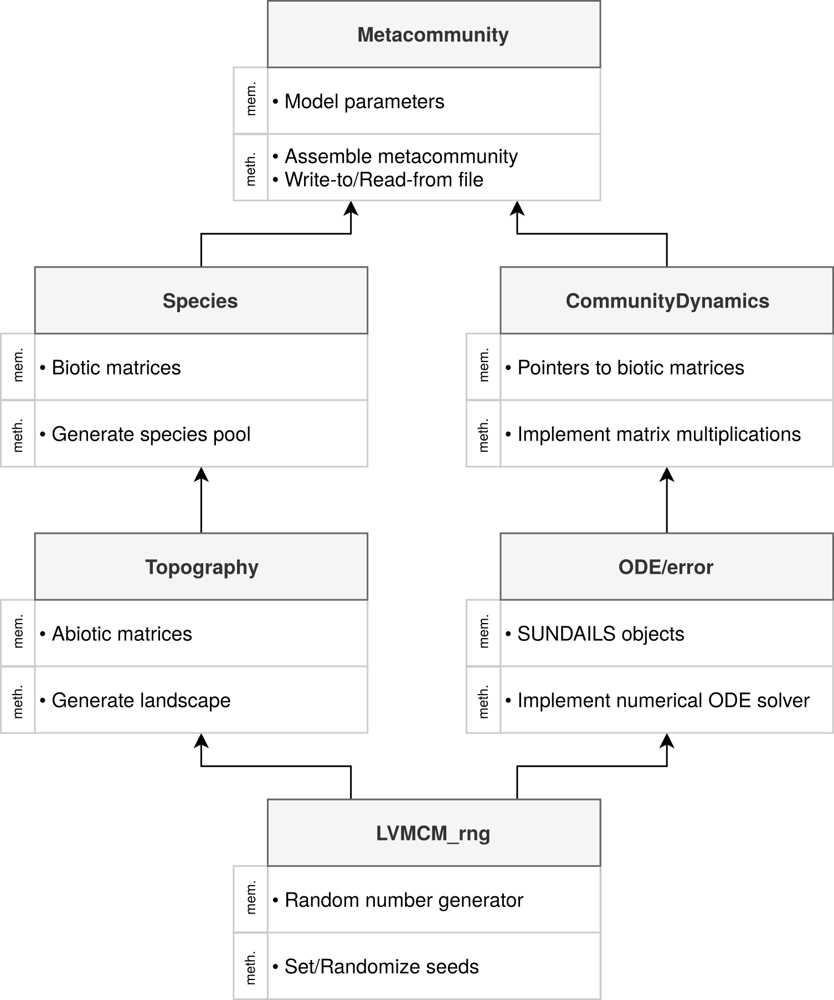

# LVMCM reference manual
***
## Hierarchical structure of LVMCM classes
<p align="center">


***
## Topography <a name="topography"></a>

```
class Topography {
public:
// members
    unsigned int subdomain = 0; // subdomain identifier
    uvec subdom_nodes; // subdomain node indices

    // parameters
    int no_nodes; // number of nodes (patches) in graph (metacommunity)
    int bisec; // number of bisections for domain decomposition
    int envVar; // number of environmental variables
    double var_e; // variance of the environmental distribution (implicit or explicit)
    double phi; // environmental autocorrelation length
    double T_int; // Intercept of linear temperature gradient

    // switches
    bool randGraph = true; // switch between random graph (1) and lattice (0)
    bool gabriel = true; // switch between gabriel (1) and complete graph (0)

    // matrix objects
    mat network; // x,y coords of nodes
    mat distMat; // euclidean distances between nodes
    mat sigEVec; // Eigenvectors of spatial covariance matrix
    mat sigEVal; // Eigenvalues of spatial covariance matrix
    mat adjMat; // spatial adjacency matrix
    uvec fVec; // indicator vector for domain decomposition
    uvec cFVec; // cumilatively count nodes in subdomains
    uvec intIF; // internal interface nodes
    uvec adjIF; // adjacent interface nodes
    mat envMat; // envVarxN matrix encoding the spatial distribution in enviromental variables

// methods
    // topo modelling
    void genNetwork(); // generate random network
    void genDistMat(); // generate distance matrix
    void genAdjMat(); // generate adjacency matrix
    void genDomainDecomp(mat netImprtd = {}); // domain decomposition algorithm
    void genEnvironment(); // Samples from envVar GRFs and stores values in environment matrix
    void genTempGrad(); // generate linear temperature gradient T(x) = T_int - sqrt(N)*x

// (default) constructor
    Topography() {}

// (default) deconstructor
    ~Topography() {}
};

```
#### Methods:
<a id='gennetwork'/>
#### `void genNetwork()`
*Generate the spatial network*

1. Generate the cartesian coordinates of metacommunity nodes, sampling from a model landscape of side length `sqrt(no_nodes)`.
	- `if(randGraph)` randomly sample coordinates from a uniform distribution.
	- `else` generate linearly space vector and expand into a lattice. Requires perfect square `no_nodes`.

2. Order nodes by vector norm so that node IDs are spatially clustered.

3. Generate distance and adjacency matrices by calling `genDistMat()` and `genAdjMat()`.

<a id='genDistMat' />
#### `void genDistMat()`
*Generate the distance matrix*

1. Generate distance matrix whose elements are the Euclidean distances of the spatial network.

<a id='genAdjMat' />
#### `void genAdjMat()`
*Generate spatial adjacency matrix*

1. Generate adjancy matrix of planar graph
	- `if (gabriel)`, by application of the [Gabriel algorithm](https://en.wikipedia.org/wiki/Gabriel_graph) which assigns edges between nodes x and y **if** there are no nodes z within the circles whose diameter is defined by the line joining x and y.
	- `if (!gabriel)`, assign all off-diagonal elements to 1 (complete graph).

<a id='genEnvironment' />
#### `void genEnvironment()`
*Generate `envVar` independent environmental distributions*

1. Generate and decomposes the landcape covariance matrix, autocorrelation length, `phi`.
2. Generate `no_nodes` random normal variables.
3. Sample value of the `envVar` environmental variables at points corresponding to spatial coordinates of nodes from spatially correlated [random fields](https://en.wikipedia.org/wiki/Multivariate_normal_distribution#Drawing_values_from_the_distribution
	- mean of random field set to 0 [CHECK]
	- variance of random field set to 1 [CHECK]
4. Stores `envVar` distributions in `envMat`.

<p align="center">


<a id='genDomainDecomposition' />
#### `void genDomainDecomposition()`
*Decompose the spatial network for parellelization using recursive spectral bisection*

1. Generate graph by calling `genNetwork()`.
2. Generate the [Graph Laplacian](https://en.wikipedia.org/wiki/Laplacian_matrix), `lMat = dMat - wMat;` for each of the current subdomains (initially the whole domain) in turn by computing the:
	- adjacency matrix, weighted by the inverse distance for the focal subdomain, `wMat`
	- diagonal matrix summarizing the weighted edges of each node, `dMat`
3. Extract the [Fielder vector](https://en.wikipedia.org/wiki/Algebraic_connectivity#Fiedler_vector) by spectral decomposition
4. Define the indicator vector of the subdomain, bisecting the Fielder vector by its median

**If subdomains are not balanced or incomplete the algorithm will `break` and reseed the graph.**

5. Re-order the network by sub-domain allocation. This means that all columns corresponding to a given sub-domain in the spatially explicit matrix objects will be clustered together - required for the `MPI_Allgather` implementation.
8. 'Naming' of the first subdomains reset to 0 so that the indicator vector can be used to index c++ objects.
9. If required by the experiment, the environmental distribution is generated by calling `genEnvironment();`
<p align="center">

***

### Species <a name="species"></a>

```
class Species: public Topography {
public:
// members
    Topography topo; // 'topography' nested within 'species'

    // parameters
    double c1; // interspecific competition parameter 1 - (disc: c_ij; cont: alpha)
    double c2; // interspecific competition parameter 2 - (disc: P(c_ij); cont: beta)
    double rho; // consumer mortality
    double sigma; // standard deviation log-normal attack rate distribution
    double alpha; // base attack rate
    double pProducer = 0.5; // probability of invading a producer species
    double emRate; // emigration rate
    double dispL; // dispersal length
    double thresh = 1e-4; // detection/extinction threshold
    double sigma_t = 0.05; // standard deviation of Ohrstein-Uhlenbeck process
    double omega = 0.5; // parameter controlling the width of the temperature niche

    // switches
    bool prodComp = true; // select producer competition on/off
    bool discr_c_ij = true; // select discrete/continuous c_ij

    // matrix objects
    mat bMat_p; // PxN biomass matrix - producers
    mat bMat_c; // CxN biomass matrix - consumers
    mat bavMat_p; // PxN biomass average matrix - producers
    mat bavMat_c; // CxN biomass average matrix - consumers
    mat bMat_p_src; // PxN biomass matrix - producers, source only
    mat bMat_c_src; // CxN biomass matrix - consumers, source only
    mat rMat; // PxN r matrix - producers
    mat sMat; // PxN r matrix ignoring temperature dependence - producers
    mat cMat; // PxP competitive overlap matrix - producers
    mat aMat; // PxC feeding interaction matrix
    mat uMat_p; // fixed unknowns - producers
    mat uMat_c; // fixed unknowns - consumers
    mat tMat; // environmental tolerances for explicit aboitic modelling
    mat dMat_n; // (sub)domain dispersal matrix
    mat dMat_m; // inter-subdomain dispersal matrix
    mat emMat_p; // species specific emigration rates - producers
    mat emMat_c; // species specific emigration rates - consumers
    mat ouMat; // Ohrstein-Uhlenback process
    mat efMat; // environmental fluctuations centred on 0 for perturbing R
    vec bias; // species specific bias of environmental fluctuation

    // storage objects
    mat trajectories; // matrix that will store the trajectories for analysis
    mat fluctuations; // matrix that will store time dependent growth rate matrices during relaxation
    umat sppRichness; // vector recording species richness as a function of time T

    // counters
    int invasion = 0; // counter used for recording number of invasions
    int invEvent = 0; // number of invasion events
    int inv0 = 0; // record number invasions at import
    int S_p = 0; // producer species richness
    int S_c = 0; // consumer species richness

// methods
    // species modelling
    void genDispMat(); // generate dispersal matrix
    mat genRVec(rowvec zVecExt = {}); // generate a spatially correlated random field of maximum internal growth rates, random variables can be passed from outside
    mat genRVecTemp(); // generate a spatially correlated random field mapped onto the output of a temperature response function
    void updateRVecTemp(); // regenerate internal growth rate matrix after discrete warming event
    void ouProcess(); // updates efMat for modelling temporal abiotic turnover of temporal autocorrelation sigma_t, and bias mu
    mat genRVecERF(); // generate random specific environmental tolerance vector (outcome of implicit Environmental Response Function) and use to generate r_i
    void invade(int trophLev, bool test = true); // add new producer (trophLev=0) or cosumer (1) to specified 'port' patch
    field<uvec> extinct(int wholeDom=1, uvec ind_p = {}, uvec ind_c = {}); // remove extinct species, wholeDom flag to indicate if species testing required (whole domain only)
    void subSet(int domain); // subset whole domain objects into designated subdomain objects

    // (default) constructor
    Species () {}

    // (default) deconstructor
    ~Species () {}
};
```
#### Methods:
<a id='genDispMat' />
#### `void genDispMat()`
*generate the dispersal operator based on distance and adjacency matrices*

1. Transform the spatial distance matrix using exponetial dispersal kernel and characterisic dispersal length`
2. Element-wise multiplication by adjaceny marix
3. Normalize dispersal matrix
4. Assign emigration terms (-e) to diagonal

`if emRate < 0`:
- emRate parameter is left out of dispersal matrix since this is instead included in the dynamics. This allows for a distribution in species emigration rates but required more floating point operations..

<a id='genRDistImp' />
#### `mat genRDistImp(rowvec ZVec = {})`
*add a spatially autocorrelated growth rate vector to the matrix R*

Algorithm equivalent to `topography::genEnvironment()` above, returns single growth rate row vector.
Argument ZVec allows random variables to be explicitly passed to the function.

<a id='genRDistExp' />
#### `mat genRDistExp()`
*add a spatially autocorrelated growth rate vector to the matrix R with R_ix, a function of the explicity modelled environment at location x*

1. Sample species' numerical tolerances to environmental variables from a spherical distribution
2. Compute the growth rate vector as the matrix product of the tolerance vector and the spatially explicit environmental distribution
3. Store tolerances in `tMat` and return growth rate vector

<p align="center">


<a id='resetRDistExp' />
#### `void resetRDistExp()`
*regenerate the matrix R after perturbation to the explicitly modelled abiotic environment*

1. Update growth rates following perturbation of explicitly modelled environment.

<a id='ouProcess' />
#### `void ouProcess()`
*models temporal abiotic fluctuations using an Ohrstein-Uhlenbeck process*

1. Generate an NxS matrix of standard normal random number_of_variables
2. Advance the OU process stored in `ouMat` according to OU(t)
 = (OU(t-1) + sigma_t * Z) / sqrt(1 + sigma_t*sigma_t), where `sigma_t` controls the temporal autocorrelation of the process.
3. Pass the updated state of the OU process to the function `genRDistImp()` which returns a spatio-temporally correlated perturbation to the growth rate vector, stored in `efMat`.

<a id='invade' />
#### `void invade(int port, int trophLev, bool test)`
*model an invasion by sampling ecological coefficeints and updating the matrix objects*

`if (trophLev == 0)` generate a producer species:

1. Add zero vector to `bMat_p` and add `inv = 1e-6` biomass units to a random node
2. Add row to `rMat` using:
	- `genRDistImp()` or `genRDistExp()`
3. In the case of bipartit models add a row to `aMat`, sampling from log normal distribution
4. In the case the model includes direct competition between producer species, add row/col to `cMat`.
	- `if (discr_c_ij == 1)` sample from a discrete distribution with probability of a non-zero element `c1` and magnitude `c2`.
	- `else if (discr_c_ij == 0)` sample from a continuous beta distribution with shape parameters `c1` and `c2`

`if (trophLev == 1)` generate a consumer species

1. Add zero vector to `bMat_p` and add `inv = 1e-6` biomass units to a random node
2. Add col to `aMat` sampling from log normal distribution:

`if emRate < 0`

1. Each species also allocated a specific emigration rate to model a distribution in dispersal ability

<a id='extinct' />
#### `field<uvec> extinct(int invade = 1, uvec ind_p = {}, uvec ind_c = {}, int wholeDom=1)`
*check for and remove regionally extinct species*

`if (wholeDom == 1)` scans for extinct Species

1. Scan each row of the biomass matrices. If the number of local populations exceeding the threshold is exactly zero, the index of the corresponding row (species) is recorded.
2. Rows/cols of corresponding model objects are shed
4. Return indices to broadcast to non-root processes

`if (wholeDom == 0)` take extinction index as argument

1. Rows/cols of corresponding model objects are shed

<a id='genSubSet' />
#### `void subSet(int domain)`
*subset spatially resolved matrix objects by subdomain*

1. Extract column indices corresponding to the focal subdomain and subset matrix objects accordingly
2. Compute lists of intra- and inter-subdomain edges and store in `intIF` and `adjIF` respectively
3. Generate the restriction opertors `P_n` and `P_m`
4. Compute the intra- and inter-subdomain dispersal operators: `dMat_n = P_n * dMat_n * P_n.t(); dMat_m = P_m * dMat_n * P_n.t();`

***

### CommunityDynamics

```
class CommunityDynamics : public ODE_dynamical_object {
public:
// members
    // matrix objects
    mat *bMat_p {}; // producer biomass matrix
    mat *bMat_c {}; // consumer biomass matrix
    mat *emMat_p {}; // producer biomass matrix
    mat *emMat_c {}; // consumer biomass matrix
    const mat *uMat_p {}; // producer interface state
    const mat *uMat_c {}; // consumer interface state
#ifdef SPARSE_IMAT
    sp_mat *cMat; // producer interaction matrix (sparse)
#else
    mat *cMat {}; // producer interaction matrix
#endif
    mat *aMat {}; // trophic interaction matrix
    mat *rMat {}; // producer growth rate matrix
    mat *efMat {}; // environmental fluctuation matrix
    mat *dMat {}; // regional dispersal operator
    mat *dMat_n {}; // subdomain dispersal operator
    mat *dMat_m {}; // inter-subdomain dispersal operator
    double *rho {}; // consumer respiration rate

// methods
    virtual int dynamics(ODE_vector const & state, ODE_vector & time_derivative); // CVode dynamical object
    virtual void write_state_to(ODE_vector & state) const; // reads state variables into ODE_vector 'state'
    virtual void read_state_from(const ODE_vector & state); // writes state to shared memory object bMat_p/c
    virtual int number_of_variables() const; // computes number of state variables

    // (default) constructor
    CommunityDynamics() {}
    // (default) deconstructor
    ~CommunityDynamics() {}
    // copy constructor
    CommunityDynamics(const CommunityDynamics &C);
    // assignment operator
    CommunityDynamics & operator=(const CommunityDynamics &C);
};
```

#### Methods:
<a id='dynamics' />
#### `virtual int dynamics(ODE_vector const & state, ODE_vector & time_derivative)`
*the matrix operations required for numerically approximating metacommunity dynamics*

1. Initialize matrices `B_p`, `B_c`, `dBdt_p` and `dBdt_c` which share memory with ODE_vectors `state` and `time_derivative` giving CVode machinery access to Armadillo matrix operations
2. Initialize matices `prodGrowth`, `consGrowth`, `prodDisp`, `consDisp` used in **modular construction of model objects**
3. If `efMat` exists, `rMat` is updated to include the OU process.
4. Construct prodGrowth = R - C \* B_p - A \* B_c
5. Construct consGrowth = rho \* (A^T \* B_p - 1)
6. Construct prodDisp:
	- non-parallel LVMCM: prodDisp = B_p \* D
	- parallel LVMCM: prodDisp = B_p \* D_n + U
  - if `emMat` exists, emigration parameter is missing from D; instead dispersal is modelled as `(emMat % B) * dMat`.
7. Construct consDisp:
	- non-parallel LVMCM: consDisp = B_c \* D
	- parallel LVMCM: (parallel), consDisp = B_c \* D_n + U
8. Construct dBdt_p = B_p . prodGrowth + prodDisp
9. Construct dBdt_c = B_c . consGrowth + consDisp

<a id='write_state_to' />
#### `virtual void write_state_to(ODE_vector & state) const;`
*pass data from Metacommunity to CVode objects*

1. Copy `bMat_p` into `ODE_vector state` elements 0 to S_p-1
2. Copy `bMat_c` into `ODE_vector state` elements S_p to S_c-1

<a id='read_state_from' />
#### `virtual void read_state_from(const ODE_vector & state);`
*pass data from CVode to Metacommunity objects*

1. Copy elements 0 to S_p-1 of `ODE_vector state` into `bMat_p`.
2. Copy elements S_p to S_c-1 of `ODE_vector state` into `bMat_c`

<a id='number_of_variables' />
#### `virtual int number_of_variables() const; // computes number of state variables`
*compute the dimensionality of the model*

1. Sums number of elements of `bMat_p` and `bMat_c` for intialization of `ODE_vector state`

***

### Metacommunity

```
class Metacommunity: public Species {
public:
    // members
    Species sppPool; // biotic community sppP

    // assembly parameters
    int invMax; // total number invasions
    int iterS; // number Schwarz iterations
    int deltaT; // size of Schwarz timewindow
    int tMax; // relaxation time
    int S_p = 0; // record species richness for cleanup
    int S_c = 0; // record species richness for cleanup

    // matrix objects - check each of these is required
    mat jacobian; // stores numerical approximation of Jacobian matrix
    mat cMat_reg; // stores effective interaction matrix computed numerically using harvesting experiment
    mat invasionProb_p; // record fraction of successful invaders - producers --- obselete
    mat invasionProb_c; // record fraction of successful invaders - consumers --- obselete
    mat invasionProb;

    // data handling objects
    string bMatFileName;
    string jobID = "NA";
    double parOut;
    string experiment;
    int rep;
    string date;
    double simTime = 0;
    int rank = 0;
    string outputDirectory;

    // switches
    int storeTraj = 0; // 0, turn off; 1, record, don't concatenate; 2, concatenate trajectories for multiple invasions

    // methods
    void metaCDynamics(int T, bool dispersal = true); // ODE solver - NxS coupled ODEs - simulation metacommunity dynamics
    uvec invaderSample(int trophLev, int no_invaders); // ...
    mat invaderCleanup(int trophLev, uvec posGrowth); // ...
    void invaderPopulate(int trophLev, mat bInv_max); // ...
    void envFluct(); // simulate dynamics in context of temporal abiotic turnover
    void warming(double dTdt, int res, int time); // simulate dynamics in context of regional warming
    void longDistDisp(int tMax, int edges); // randomly add fast, dispersal between (potentially) distant nodes
    void genJacobian(); // generates numerical approximation of Jacobian
    void genCMatReg(double h = 0.001); // simulates harvesting experiment
    void genSourceSink(int tFullRelax = 1000); // switch off dispersal to assign source-sink populations
    void performanceTest(bool init, int repPer, int S_p = 0, int S_c = 0); // peformance testing of dynamics
    void writePars(int repPer); // write parameters to file for performance testing

    // book keeping functions - store, output and import data
    void printParams();
    void outputData();
    void cleanup();
    void importData(string bMat);

    // (default) constructor
    Metacommunity () {}

    // (default) deconstructor
    ~Metacommunity () {}

    // intialization constructor
    Metacommunity (
            // Metacommunity parameters
            bool a_init,
            string a_bMat,
            int a_invMax,
            int a_iterS,
            int a_deltaT,
            int a_tMax,
            string a_outputDirectory,
            // Species parameters
            double a_c1,
            double a_c2,
            double a_emRate,
            double a_dispL,
            double a_pProducer,
            bool a_prodComp,
            double a_alpha,
            double a_sigma,
            double a_sigma_t,
            double a_rho,
            bool a_discr_c_ij,
            double a_omega,
            // Topograpy parameters
            int a_no_nodes,
            double a_phi,
            int a_envVar,
            double a_var_e,
            bool a_randGraph,
            bool a_gabriel,
            int a_bisec,
            double a_T_int,
            // output variables
            double a_parOut,
            string a_experiment,
            int a_rep,
            string a_jobID
        )
    {
        // Parameterize
        if (a_init) { // initialize new metacommunity model
            invMax = a_invMax;
            iterS = a_iterS;
            deltaT = a_deltaT;
            tMax = a_tMax;
            parOut = a_parOut;
            experiment = a_experiment;
            rep = a_rep;
            time_t t = time(0);
            struct tm * now = localtime( & t );
            ostringstream dateTemp;
            dateTemp << (now->tm_year + 1900) << '-'
                     << (now->tm_mon + 1) << '-'
                     <<  now->tm_mday;
            date = dateTemp.str();
            outputDirectory = a_outputDirectory;
            jobID = a_jobID;
            sppPool.c1 = a_c1;
            sppPool.c2 = a_c2;
            sppPool.emRate = a_emRate;
            sppPool.dispL = a_dispL;
            sppPool.pProducer = a_pProducer;
            sppPool.prodComp = a_prodComp;
            sppPool.alpha = a_alpha;
            sppPool.sigma = a_sigma;
            sppPool.sigma_t = a_sigma_t;
            sppPool.rho = a_rho;
            sppPool.discr_c_ij = a_discr_c_ij;
            sppPool.omega = a_omega;
            sppPool.topo.no_nodes = a_no_nodes;
            sppPool.topo.phi = a_phi;
            sppPool.topo.envVar = a_envVar;
            sppPool.topo.var_e = a_var_e;
            sppPool.topo.randGraph = a_randGraph;
            sppPool.topo.gabriel = a_gabriel;
            sppPool.topo.bisec = a_bisec;
            sppPool.topo.T_int = a_T_int;
            sppPool.topo.network.reset();
            sppPool.topo.distMat.reset();
            sppPool.topo.adjMat.reset();

        } else { // import metacommunity model
            importData(a_bMat);
            outputDirectory = a_outputDirectory;
            if (a_invMax != 0) {
                invMax = a_invMax;
                cout << "\ninvMax updated" << endl;
            }
            if (a_bisec != 0) {
                sppPool.topo.bisec = a_bisec;
                cout << "\nbisec updated" << endl;
            }
            if (a_iterS != 0) {
                iterS = a_iterS;
                cout << "\niterS updated" << endl;
            }
            if (a_deltaT != 0) {
                deltaT = a_deltaT;
                cout << "\ndeltaT updated" << endl;
            }
        }
    }
};
```

#### Methods:

<a id='metacdynamics' />
#### `void metaCDynamics(int T, bool dispersal = true)`
*This function initializes and runs the CVode machinery*

In the case dispersal = false, no dispersal operator is passed to CommunityDynamics which will therefore simulate _without_ immigration terms.
This is used for invader testing only.
Otherwise, if the number of rows in the `sppPool.topo.network` object is equal to `sppPool.topo.no_nodes`, then the whole domain scale is detected and the non-parallel solution used to simulate dynamics.
In contrast, if the number of rows in the `sppPool.topo.network` is less than `sppPool.topo.no_nodes`, this implies the subdomain scale, and the parallel solution is used.

In all cases the first step is to intialize a `CommunityDynamics dynamics` object and declare the members of this object as pointer to the various model matrices e.g `dynamics.bMat_p = &sppPool.bMat_p;`.
The dynamics are then simulated.
`if (storeTraj == 0)` this is done without recording intermediate states.
`if (storeTraj == 1)`, intermediate states are recorded with a resolution of `int res`.

#### `uvec invaderSample(int trophLev, int no_invaders)`
*This function generates and tests random invaders for positive growth*

Random species and ecological coefficients sampled from user defined distributions and dynamics simulated for a handful of timesteps without dispersal.
Indices of species with positive growth in at least one community are return and later the results at each subdomain are combined to assess invasion success at the regional scale.
`no_invaders` invaders are introduced, producers and consumers are sampled separately and selected via the argument `trophLev`.

#### `uvec invaderCleanup(int trophLev, uvec posGrowth)`
*This function removes unsuccessful invaders and excess species*

Taking the index of regionally successful invaders as an argument, unsuccessful invaders are removed from model objects

#### `void invaderPopulate(int trophLev, mat bInv_max)`
*This function adds missing coupling coefficients and introduces invaders at low biomass into their favoured community*

Having gathered the maximum biomass of each invader from each subdomain, this function adds missing coupling terms to the competition matrix, resets the biomass matrix with invaders introduced at low biomass to the local community in which their growth rate was maximized during testing.

<a id='genjacobian' />
#### `void genJacobian()``
*Generate the numerical approximation of the Jacobian matrix*

Initilize `CommunityDynamics dynamics` object and used inbuilt functionality to generate numerical approximation of the Jacobian, stored in `jacobian`

<a id='gencmatreg' />
#### `void genCMatReg(double h=0.001)`
*This function computes the regional scale competive overlap matrix `cMat_reg`.*

1. Generate and inverse the numerical approximation of the Jacobian using [`genJacobian()`](#genjacobian), and `arma::inv()`.
2. Generate population indices: `uvec index = linspace<uvec>(0, sppPool.landscape.no_nodes-1, sppPool.landscape.no_nodes); index *= S_tot;`. These will be iteratively incremented for to index each species.
3. Looping through all species, generate the harvesting terms `H_i.elem(index + i) = h * sppPool.bMat_p.row(i);`
4. compute the (vector) shift in biomass per unit harvesting as `dB_jx = -1 * (J_inv * H_i) / h;`. Convert to matrix form, row sum and store int the ith column of the matrix `cMat_reg`.
5. Generate the normalization factors `mat norm, sng` and normalize to compute the regional scale _competitive overlap_ coefficents.

<a id='gensourcesink' />
####  `void genSourceSink(int tFullRelax = 1000)`
*This function assigns populations as either source or sink*

Dispersal is switched off and the metacommunity relaxed to new equilibrium in which all sink populations are absent. Discrete matrices `bMat_p/c_src` are then generated for which undetected populations are assigned 0, source poulaitons, 1, and sink populations -1.

1. Store copies of `dMat_n`, `bMat_p` and `bMat_c`.
2. Fill off-diagonal elements of `dMat_n` with zeros to switch off dispersal. Note, diagonal elements are retained (`-emRate`) since otherwise, the effective local growth rates would not correspond to the full metacommunity model.
3. Metacommunity dynamics are simulated using [`metaCDynamics()`](#metacdynamics).
4. Matrices `Src_p/c` are generated assigning 1s to all source populations, those above the detection threshold after switching off dispersal.
5. Biomass matrices are reset and presence-absence assessed and stored in `Snk_p/c`.
6. Sink populations are allocated -1 by subtracting `Snk_p = Src_p - Snk_p`.
7. The source sink matrix is generated by summing `sppPool.bMat_p_src = Src_p + Snk_p;`

<p align="center">


<a id='randomizebmat' />
### `void randomizeBMat(int rand = 1, int tFullRelax = 1000)`

*This function randomly shuffles the elements of the biomass matrices then allows the metacommunity to relax to (new) equilibrium.*

1. Define the folder/filename for the output matrices. These are either generated from scratch in the normal way (see [`outputData()`](#outputdata)), or by altering the importFileName in the case that the metacommunity model was pre-assembled. In both cases, the name of the biomass matrix is used to generate a new folder within the associated SimulationData directory. Then each randomized/relaxed matrix will be saved under the same name "bMatR" with the integer `rand` appended to avoid over-writing.
2. Biomass matrices are randomly shuffled using `arma::shuffle()`.
3. Metacommunity is relaxed using [`metaCDynamics()`](#metacdynamics).
4. Resultant matrix is stored.

<a id='performancetest' />
### `void performanceTest(bool init, int repPer, int S_p = 0, int S_c = 0)`
*Generate a random metacommunity without assembly for testing parallelization*

In order to explore the efficiency gain as a function of model parallization for different model assumptions, this function initializes a random metacommunity and then stores the wall time and the biomass matrices, *after* the parallel algorithm in main.cpp is run.

`if (init)`:
1. `S_p` producer species invaded *without* testing.
2. `if (sppPool.pProducer < 1.0)` `0.5*S_p` consumer species are invaded
3. The elements of the biomass matrices are then sampled from a lo-normal distribution which is normalized so that the largest local biomass is 1.0.

`if (!init)`:
1. Directory and filename of the biomass matrix is generated ("bMatP")
2. Only `if (rand == 1)` biomass matrices are stored, under the assumption that the result of the simulation is identical between runs
3. The complete parameter file is generated from which `bisec` and `simTime` can be used to test the performance gain due to parallelization

<a id='printparams' />
#### `void printParams()`
*This prints model parameterization to console*

<a id='outputdata' />
#### `void outputData()`
*This function saves model objects*

1. Record the location from which executable is run and check for known file hierarchies.
2. If known, follow standard file storage protocol, else save data in current repo. If directory does not currently exist, generate.
3. Generate filenames for each model objects. If model imported, filenames are generated from imported model location
4. Store model objects.

<a id='importdata' />
#### `void importData(string bMat)`
*This function loads model objects*

1. Generate filenames of all model objects based on input biomass matrix filename.
2. Load matrices and parameterize from parameter file.
